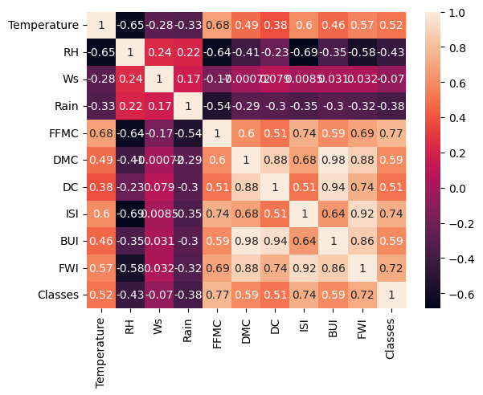
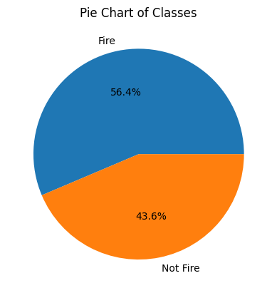
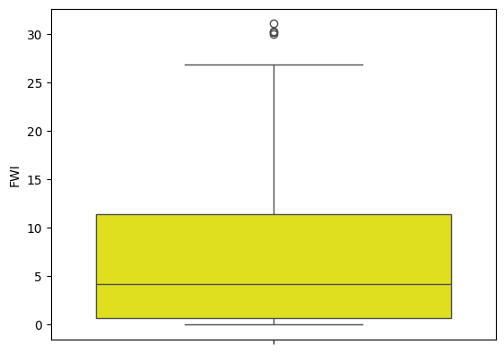
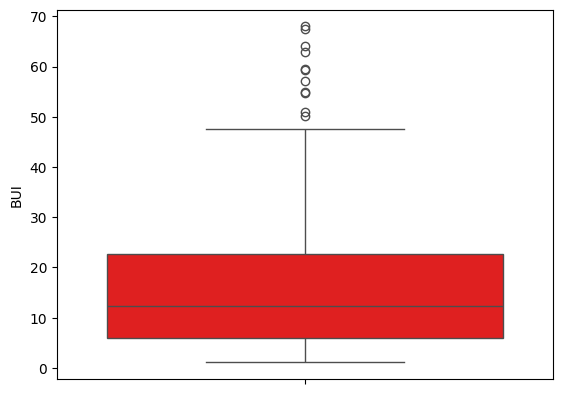
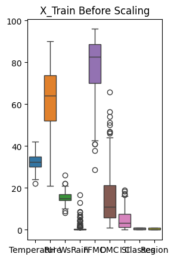
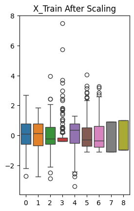
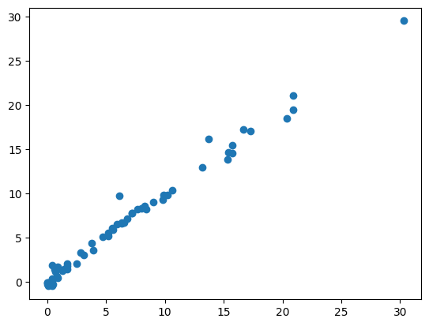
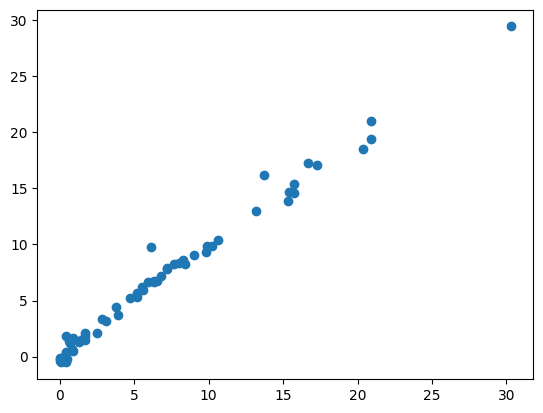
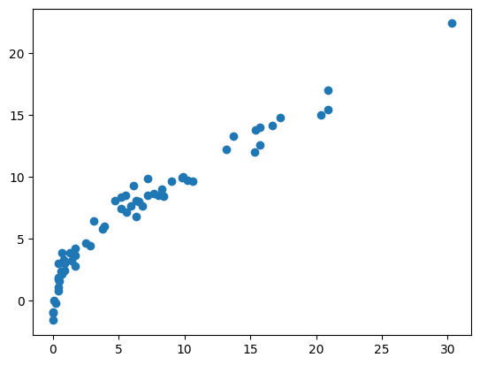

# 🔥 Algerian Forest Fires And Sidi-Bel Abbes Region - FWI Prediction
# Overview 
This end-to-end regression project applies Linear, Multiple, Ridge, Lasso, and Elastic Net Regression techniques. The workflow includes Data Cleaning, Exploratory Data Analysis (EDA), Feature Engineering, Feature Selection, Model Training, and Hyperparameter Tuning.

This project predicts the Fire Weather Index (FWI) for Algerian forest regions using various regression models. The application is built with Streamlit for interactive predictions and is deployed on Streamlit Community Cloud.

## Live Website Link - [Website](https://shachi12shukla-linear-to-elasticnet-application-excypm.streamlit.app/)
### NOTE - If you see 'app is sleeping' then click on 'get the app' button .
**Dataset Source:** [UCI Machine Learning Repository](https://archive.ics.uci.edu/dataset/547/algerian+forest+fires+dataset)


## Data Set Information

The dataset includes 244 instances regrouping data from two regions of Algeria:
- **Bejaia region** (northeast Algeria)
- **Sidi Bel-abbes region** (northwest Algeria)

- **122 instances for each region**
- **Period:** June 2012 to September 2012
- **Attributes:** 11 features and 1 output attribute (class)
- **Classes:** 244 instances classified into fire (138) and not fire (106)

---

## Attribute Information

1. **Date**: (DD/MM/YYYY) Day, month ('June' to 'September'), year (2012)
2. **Temp**: Temperature noon (max) in Celsius degrees: 22 to 42
3. **RH**: Relative Humidity in %: 21 to 90
4. **Ws**: Wind speed in km/h: 6 to 29
5. **Rain**: Total day in mm: 0 to 16.8
6. **FFMC**: Fine Fuel Moisture Code index: 28.6 to 92.5
7. **DMC**: Duff Moisture Code index: 1.1 to 65.9
8. **DC**: Drought Code index: 7 to 220.4
9. **ISI**: Initial Spread Index: 0 to 18.5
10. **BUI**: Buildup Index: 1.1 to 68
11. **FWI**: Fire Weather Index: 0 to 31.1 (output/dependent feature)
12. **Classes**: Fire or not fire (output classification)

> **Note:** FWI is the output (dependent feature); all others are independent features.

---

## Feature Engineering

- **Multicollinearity Check:**  
  Highly correlated features (BUI and DC) were removed to improve model performance.
  Constructed a Heatmap - 
   
---

## Outputs & Visualizations

1. **Pie Chart:**  
   Distribution of 'classes' (fire and not fire)  
   

2. **Correlation Heatmap:**  
   Shows correlation between features  
   

3. **Box Plots:**  
   - FWI:   
   - BUI: 

4. **Box Plots For Showing Effect of Scaling:**  
   - Before Standard Scaling:   
   - After Standard Scaling: 

5. **Model Performance:**

   | Model                | MAE  | R² Score | Scatter Plot                |
   |----------------------|------|----------|-----------------------------|
   | Linear Regression    | 0.54 | 0.98     |  |
   | Lasso Regression     | 1.13 | 0.94     |                             |
   | Ridge Regression     | 0.56 | 0.98     |    |
   | ElasticNet Regression| 1.88 | 0.87     |  |

6. **Pickled Models:**  
   - `scaler.pkl`: StandardScaler model  
   - `ridge.pkl`: Ridge Regression model

7. **Streamlit Application:**  
   - `application.py`: Streamlit app code for FWI prediction

---

## How to Run Locally

1. **Clone the repository:**
   ```
   git clone https://github.com/Shachi12Shukla/Linear_To_ElasticNet.git
   cd Linear_To_ElasticNet
   ```

2. **Install dependencies:**
   ```
   pip install -r requirements.txt
   ```

3. **Run the Streamlit app:**
   ```
   streamlit run Application.py
   ```

---

## Deployment

- The project is deployed on [Streamlit Community Cloud](https://streamlit.io/cloud).
- Ensure `requirements.txt` is present in the root directory for dependency installation.

---


